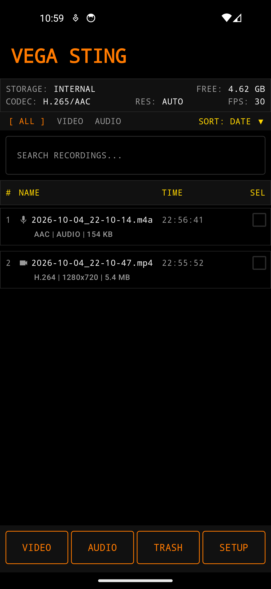
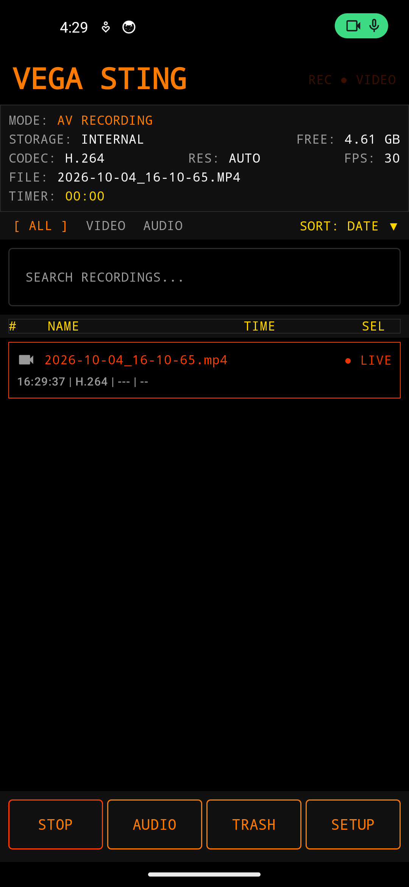
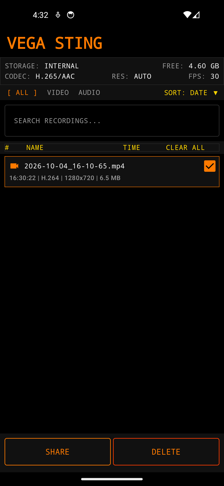
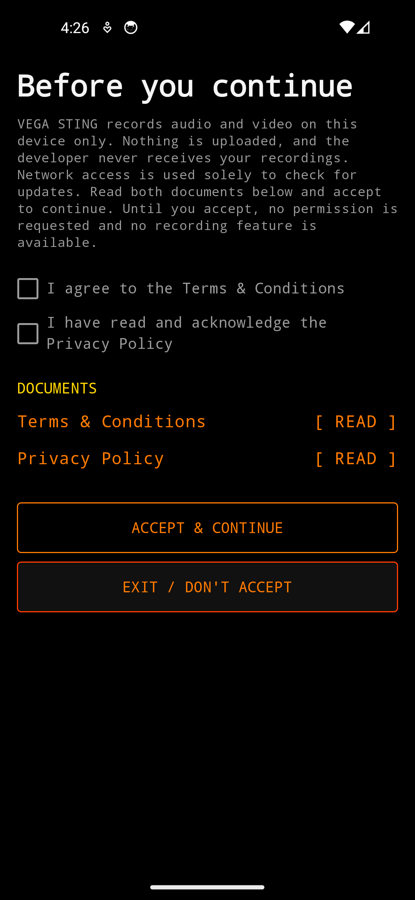
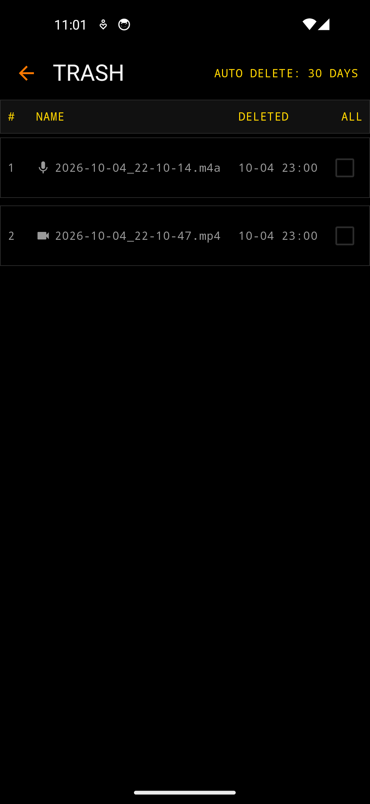
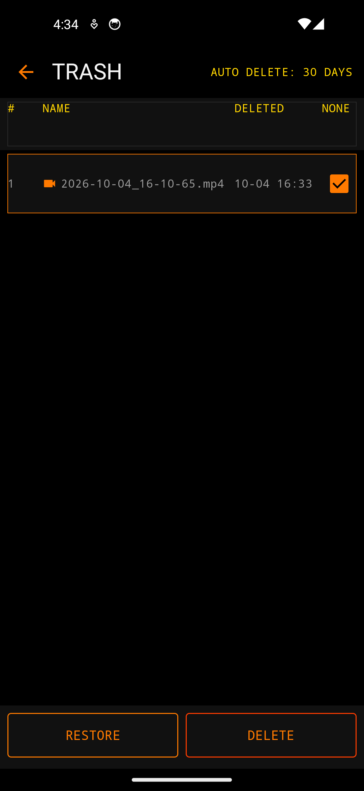
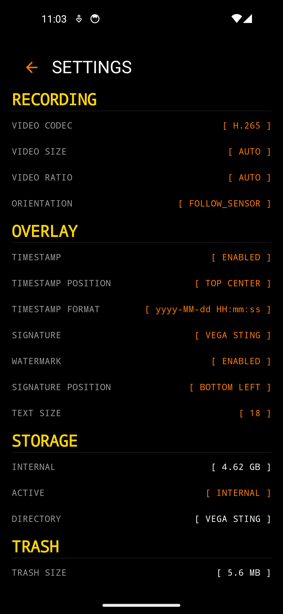

<p align="center">
  
</p>

<h1 align="center">VEGA STING</h1>

<p align="center"><strong>
Personal Safety Recording. Local by Design. Evidence When You Need It.
</strong></p>

<p align="center">
  <a href="https://github.com/Kvijay199428/VEGA-STING/releases/latest">Latest release</a> ·
  <a href="#install">Install</a> ·
  <a href="#how-to-use">How to use</a> ·
  <a href="#tutorial">Tutorial</a> ·
  <a href="#privacy-by-design">Privacy</a> ·
  <a href="#development">Development</a>
</p>

---

## What is VEGA STING?

VEGA STING is a privacy-first Android audio and video recording app built
around one idea:

> **When an unexpected situation happens, the ability to preserve what
> happened should remain in the user's hands.**

It is a fast, user-controlled way to capture audio and video, keep
recordings on your own device, review them later, and share them only when
*you* decide to. It is built for lawful personal, professional,
journalistic, documentary, and safety-oriented recording — not for
uploading to someone else's cloud or serving an ad network.

VEGA STING is a recording and local-management tool, not a social camera,
not a cloud gallery, not an advertising platform, and not a surveillance
service.

---

## Why it can matter to you

A person involved in an unforeseen event may later need to explain what
happened, when, what was said, what was visible, and how things developed.
Human memory is unreliable, especially after a stressful event. An
audio or video recording made at the moment can preserve information that
would otherwise depend only on recollection.

Situations where a recording can be useful (depending on the law and the
circumstances) include:

- an unexpected confrontation or harassment;
- a road / transport incident;
- a dispute or disagreement, documented while calm;
- workplace incidents where recording is permitted;
- journalistic or documentary work;
- personal documentation of an important event;
- other unforeseen circumstances where preserving audio or video is
  appropriate.

VEGA STING lets you record when *you* judge it appropriate and lawful.
These examples are illustrative; capturing another person is not
automatically lawful in every case — see
[Responsible & lawful use](#responsible--lawful-use).

---

## Features

- **Audio and video recording** via Camera2 and `MediaRecorder`, with
  hardware-adaptive sizing, codecs and frame rates.
- **Foreground recording** that keeps camera and microphone running even
  with the screen off.
- **Quick Settings tile** and a **home-screen widget** and app
  **shortcuts** for starting a recording quickly.
- **Local storage** on internal, SD card or USB OTG, with storage health
  checks and a clear/free indicator.
- **Trash with a 30-day retention** sweep, restore, empty and permanent
  delete.
- **Signature / watermark overlay** (timestamp, position, text size) on
  new recordings.
- **Playback, sharing and deletion** of recordings, all on-device.
- **No account, no ads, no analytics** — recordings never leave the
  device unless *you* share them.
- **OTA updates** from GitHub Releases, checked on a schedule or from
  Settings → About.

### Not currently available

- **Dual-camera (front + back) composite capture** is described in the
  design history but is **not** implemented in this build. It is a
  hardware-dependent future capability.

---

## Install

Get the latest signed release from the
[Releases page](https://github.com/Kvijay199428/VEGA-STING/releases/latest),
and pick the asset named **`vega-sting-<versionName>.apk`** (e.g. `vega-sting-1.0.4.apk`).

```bash
sha256sum vega-sting-<versionName>.apk
# expect the value published in the release notes
```

The app requires Android 8.0 (API 26) or higher and targets API 35.

Android will block a silent first install over a differently-signed build,
so on a clean device you grant the "Install unknown apps" permission when
prompted; subsequent in-app OTA updates install normally. **The release
key is not in this repository** (see [Release signing](#release-signing)).

---

## How to use

**First run.** The mandatory consent screen appears before any permission
is requested, recording is reachable, or any network request is made.
Read both documents ([Settings → Legal → Terms & Conditions / Privacy
Policy](#legal)), acknowledge them, and tap **Accept & Continue**. No
recordings are made until then.

**Home screen.** The recordings are listed with their date, time, codec,
resolution and size, filterable by the `[ ALL ]` / `VIDEO` / `AUDIO` chips
and searchable with `SEARCH RECORDINGS...`. The four buttons at the
bottom switch between **Video**, **Audio**, **Trash** and **Setup**.

**Record.** Tap **Video** or **Audio** to start. While recording you get
a live `REC ▸ VIDEO` / `REC ▸ AUDIO` indicator, elapsed time, codec and a
file target. Tap **Stop** to finish; the file is added to the list.

**Manage.** Long-press a row (or tap its checkbox) to enter selection
mode. The bottom bar becomes **Share** / **Delete**, and **CLEAR ALL**,
**SELECT ALL** appear in the header. Tapping a row outside selection mode
opens playback. From playback you can share, trim or delete.

**Trash.** Deleted items move to **Trash**, kept for **30 days**
(`AUTO DELETE: 30 DAYS`) before a WorkManager sweep permanently removes
them. Select items to **Restore** them to the library or **Delete** them
immediately.

**Settings** (`Setup` tab) groups hardware and storage choices —
RECORDING (video size/ratio/codec, orientation), OVERLAY (signature /
watermark), STORAGE (directory, SD/OTG), TRASH, HARDWARE, plus
**Legal** and **About**. Under **About** → **Check For Updates** forces an
unthrottled update check, and shows the version, build and developer.

---

## Tutorial

<!-- TODO: Replace this placeholder with your tutorial video. GitHub READMEs cannot embed MP4/WebM directly — link a YouTube/Vimeo video or a GIF, e.g.:
[](https://youtu.be/VIDEO_ID)
-->

**▶ Watch the tutorial:** *link to your video goes here*
(e.g. `https://youtu.be/…`).

### Text walkthrough

1. Accept the consent screen on first run.
2. Tap **Video** or **Audio** to start a recording; the `REC ▸` indicator
   and timer run.
3. Tap **Stop**. The new file appears in the Home list with
   resolution / codec / size.
4. Long-press a file to select it, then **Share** or **Delete**.
5. In **Trash**, select an item to **Restore** or **Delete**.
6. In **Setup**, check legal docs, toggle the signature overlay, choose
   storage, and tap **Check For Updates**.

### Screenshots

| Home | Recording | Selection |
|:---:|:---:|:---:|
|  |  |  |

| Consent | Trash | Trash selection | Settings |
|:---:|:---:|:---:|:---:|
|  |  |  |  |

---

## Privacy by design

VEGA STING is local-first: recordings are stored on your device, the
developer has no copy, and there is no recording cloud service. The app
contains **no advertising SDK, no third-party analytics, and no
third-party AI processing of recordings**. Recordings are not uploaded to
authorities and are shared only if you choose to share them.

The only network capability is the optional update check against public
GitHub Releases; **recording content is never part of the update path**.
Device/camera capability probing happens locally and is not transmitted.
Local diagnostic/session notes remain on the device and are not the same
as remote telemetry.

Deleting recordings and using **Trash** / **Auto cleanup** is under your
control.

## Responsible & lawful use

VEGA STING is a recording tool. The legality of recording another person
varies by jurisdiction, context, consent and expectation of privacy: what
the app permits, it does not judge. You are responsible for lawful use and
for respecting privacy and consent requirements; the app is **not**
intended to facilitate unlawful surveillance, stalking, harassment, or
privacy violations. VEGA STING is **not** a substitute for police,
ambulance, fire or emergency services.

A recording does not guarantee the truth, admissibility, or authenticity
of what it shows. Preserve originals carefully, avoid unnecessary edits,
keep a clear record of when and how a recording was obtained, and consult
a qualified legal professional where appropriate. See
[`PRIVACY_POLICY.md`](PRIVACY_POLICY.md) and
[`TERMS_AND_CONDITIONS.md`](TERMS_AND_CONDITIONS.md). This is not legal
advice.

---

# Development

Screen-recording terminal for Android. Black / orange / monospace UI,
built with Kotlin, Jetpack Compose and CameraX.

## Project layout

| Path | Purpose |
| --- | --- |
| `app/src/main/kotlin/com/vega/sting/MainActivity.kt` | Home screen, navigation, recording service control |
| `app/src/main/kotlin/com/vega/sting/services/RecordingService.kt` | Foreground recording service |
| `app/src/main/kotlin/com/vega/sting/database/` | Room database for recordings, metadata and trash |
| `app/src/main/kotlin/com/vega/sting/storage/` | Storage backends (internal, SD card, OTG) and health checks |
| `app/src/main/kotlin/com/vega/sting/settings/SettingsManager.kt` | DataStore-backed preferences |
| `app/src/main/kotlin/com/vega/sting/legal/` | Consent model, versioned DataStore persistence, bundled document metadata |
| `app/src/main/kotlin/com/vega/sting/ui/legal/` | First-run consent gate and offline document reader |
| `app/src/main/kotlin/com/vega/sting/ui/settings/SettingsScreen.kt` | Settings screen |
| `app/src/main/kotlin/com/vega/sting/ui/update/` | OTA dialogs and the update state host |
| `app/src/main/kotlin/com/vega/sting/updater/` | GitHub release check, APK download, installer handoff |
| `app/src/test/kotlin/com/vega/sting/legal/` | Consent completeness and version-regression tests |
| `app/src/test/kotlin/com/vega/sting/updater/` | OTA version-comparison and release-parsing tests |

## Building

Requirements:

- JDK 21
- Android SDK with `ANDROID_HOME` set (`D:\sdk\android` on the build machine)
- Gradle 8.7 via the bundled wrapper

```powershell
.\gradlew.bat clean
.\gradlew.bat :app:assembleDebug
.\gradlew.bat :app:assembleRelease
.\gradlew.bat :app:testDebugUnitTest
```

Build outputs:

- Debug: `app/build/outputs/apk/debug/app-debug.apk`
- Release: `app/build/outputs/apk/release/vega-sting-<versionName>.apk`

`assembleRelease` runs the `verifyReleaseSigning` guard first. If release-signing
properties are missing, the build fails with a clear message instead of silently
producing an unsigned APK that cannot be installed.

## Release signing

The release key is deliberately **not** in the repository. The build reads these
Gradle properties from `~/.gradle/gradle.properties`:

```properties
VEGA_STING_STORE_FILE=D:/VEGA/.keys/vega-sting.keystore
VEGA_STING_STORE_PASSWORD=<store password>
VEGA_STING_KEY_ALIAS=vega-sting
VEGA_STING_KEY_PASSWORD=<key password>
```

The key is an RSA-4096 PKCS#12 keystore, valid until 2054, SHA-256 fingerprint:

```
25:E8:A0:F0:30:04:25:9B:88:33:6F:11:DE:62:39:99:FF:9B:8B:55:E6:AD:D8:0A:7C:3A:8A:5C:C8:B8:34:14
```

Back up both the keystore and `gradle.properties` somewhere durable and private.
Anyone without the key cannot ship an update that Android will accept over an
existing installation.

### Upgrading from a debug-signed build

`1.0.0` was installed with the standard Android debug key. Android refuses to
install a differently-signed package over an existing app, so the first release
build must be installed manually:

```powershell
adb uninstall com.vega.sting
adb install app/build/outputs/apk/release/vega-sting-<versionName>.apk
```

**Do this before the first release update.** After that, OTA updates keep the
release signature and install normally.

## OTA updates

The app checks the public GitHub Releases API for a newer version and installs it
through the system Package Installer.

- Endpoint: `https://api.github.com/repos/Kvijay199428/VEGA-STING/releases/latest`
- Owner and repo come from `BuildConfig.GITHUB_OWNER` / `BuildConfig.GITHUB_REPO`
- The **latest** release is used, and the first asset ending in `.apk` is downloaded
- The APK is stored under the app-private `filesDir/updates` directory and shared
  with the installer through a `FileProvider` (`${applicationId}.provider`)

Behaviour:

- A startup check runs at most once every 6 hours and never mid-recording
- Settings → About → **Check For Updates** forces an immediate, unthrottled check
  and re-offers a version the user previously skipped
- An update found mid-recording is deferred and re-offered once recording stops
- **Skip This Version** suppresses that version until a newer one ships
- Downloaded APKs are purged after each install attempt so storage does not grow

Android requires *Install unknown apps* permission for sideloaded packages. When
it is missing, the app routes the user to the per-app settings screen and resumes
at the install prompt once the toggle is enabled.

### Publishing an update

1. Bump `versionCode` / `versionName` in `app/build.gradle.kts`.
2. Build and verify the release APK.
3. Commit and push, create an **annotated** tag named `v<versionName>`
   (for example `v1.0.2`), and push the tag.
4. Create a GitHub release whose tag is that `v`-prefixed tag and whose first
   `.apk` asset is `vega-sting-<versionName>.apk`. Record the version name and tag
   explicitly in the release notes.
5. Confirm the release is neither a draft nor a pre-release. The `latest`
   endpoint ignores both, so users would never see the build.

A release marked as a pre-release or draft is not returned by the `latest`
endpoint, so users never see an unfinished build.

## Legal consent and privacy

On first run the app shows a mandatory consent screen and stores nothing else
until it is accepted. No permission is requested, no recording UI is reachable and
no network request is made before acceptance.

- Acceptance is recorded atomically in the shared `settings` DataStore with
  `terms_accepted`, `privacy_policy_acknowledged`, `terms_version`,
  `privacy_policy_version` and `accepted_at`
- Both acknowledgements are required and neither checkbox starts pre-checked
- Bumping either document version re-collects consent on the next launch
- The full text of both documents is bundled in `res/raw` and readable offline,
  and permanently available from Settings → **Legal**

Canonical documents:

- [Privacy Policy](https://github.com/Kvijay199428/VEGA-STING/blob/main/PRIVACY_POLICY.md)
- [Terms & Conditions](https://github.com/Kvijay199428/VEGA-STING/blob/main/TERMS_AND_CONDITIONS.md)

In short: recordings stay on your device. The app has no account system, no
analytics, no ads and no third-party SDKs, and the developer never receives your
data. The only network access is the optional update check, which is not even
performed until after consent.

## Permissions

| Permission | Reason |
| --- | --- |
| `INTERNET` | Fetching release metadata and downloading the update APK |
| `REQUEST_INSTALL_PACKAGES` | Handing the downloaded APK to the system installer |
| `FOREGROUND_SERVICE` / `FOREGROUND_SERVICE_CAMERA` / `FOREGROUND_SERVICE_MICROPHONE` | Recording while the screen is off |
| `CAMERA`, `RECORD_AUDIO` | Video and audio capture |
| `READ_MEDIA_VIDEO`, `READ_MEDIA_AUDIO`, storage permissions | Playback and SD/OTG import |

## Testing

```powershell
.\gradlew.bat :app:testDebugUnitTest
```

The unit tests cover OTA version comparison (`1.10.0` > `1.9.0`, `v` prefixes,
missing segments, invalid input), release-JSON parsing (APK selection, missing
fields, explicit JSON nulls, malformed input) and legal consent completeness
(half-acceptance, version mismatch, re-consent triggers). These are the parts most
likely to break OTA updates and consent enforcement silently.

---

<p align="center">
  
  <br/>
  <strong>VEGA STING — Your device. Your recording. Your decision.</strong>
  <br/>
  Developer: <a href="https://app.vijaykrsha.online">VIJAYKRSHA.ONLINE</a>
  · Package: <code>com.vega.sting</code>
</p>
